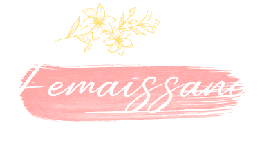

# INSPIRATHON'22
## Problem statement 
“Healthcare accessibility isn’t a privilege to women- it is a basic need and should be a priority”

Nowadays women are at par with men in all spheres of life, they are working as
successful doctors, engineers, professionals, entrepreneurs etc. Women do not feel free
to talk about their health. In some cases it becomes life-threatening. Talking about
women related health issues is still a big taboo in most parts of India. Participants are
required to find a technical solution to solve the above
 
## Our solution
Femaissance
 
<p align="center">
    
</p>
 
 
[_Project link_](https://femaissance.netlify.app/)
 
[_Video link_](https://youtu.be/uWDBd34jH-s)
 
 
## About Femaissance
 
- To connect the expertise in field of gynaecology and physiologist dealing with mental depression to a society of pregnant women. 
- To build a very transparent and accountable system which allows the flow of legitimate opinions regarding pregnancy through posts, comments. 
- This is a no-abuse platform, which deals with sensitive content and so in order to maintain the discipline we introduced the report  options for all our users. 
- Most importantly this platform has provided equal right of expression to every women regardless of being from rural or urban.
- To not build language as a barrier ,we provide the privilege to connect in their own regional languages.
 
## Inspiration behind Femaissance
 
Everyone talks about the miracle of childbirth and pregnancy 
glows, but not many speak about the never-ending aches and 
pains, and insomnia that go along with it. A woman’s body goes
through a lot during pregnancy, and while the female body is
built to handle such a miraculous event, it is by no means a 
comfortable experience to go through. Even healthy women can 
experience problems during pregnancy and after that as well. 
It is just something that happens. While most pregnancy 
problems are common and experienced by expectant mothers, 
it is always best to keep your doctor updated on changes that
you may be experiencing and get advice.
 
So considering the issues every women comes across regardless
of being from urban or rural areas, we have come up with an 
initiative called Femaissance which would not only help women
to connect to each other and lift up their overwhelming 
changes but also connect and contact expertise across the globe.
 
This platform would give freedom to its users to post ,like,chat
comment and share to increase awareness among all womens.
 
 
## Features
 
- User can register and login and can edit their profile.
- User can see others post, can filter the post according to categories,can like/unlike and share the post.
- One can comment on the post, like/unlike the comment,reply to a comment, can edit and delete their own comment. 
- User can also see the posts of the person they are following in the following post tab.
- User can view the profile of all other users in the platform, can seach them on the basis of username and bio, can share their profile.
- They can also change the language of the website to any language of their choice.
- One can post on the website with title,body,tags,with/without image and can manage their own posts in dashboard.
- User can report about others profile if they found the post inappropriate or against any community.
- User can chat with us through pop up chat if they have any doubts or want to know about us.
- User can also do one to one chat with other users to maintain privacy
## Tech Stack
 
**Client:** 
- React
- Jsx
- Scss
- Material ui
- Bootstrap
 
**Server:** 
- NodeJS
- Express
- MongoDB
 
Apart from these several third party libraries were used.
 
## Getting Started
 
1. Fork the repository.
 
2. Clone the forked repository.
```bash
git clone https://github.com/<your_user_name>/hack4women.git
```
 
3. Navigate to the cloned repository.
```bash
cd hack4women
```
 
### Prerequisite
 
Download Node.js from [here](https://nodejs.org/en/download/).
<br>
Verify installation by checking the version.
```bash
node -v
npm -v
```
 
### Installation
 
#### Server
 
Navigate to the server folder
```bash
cd server
```
Install the dependencies by running the command in the terminal
```bash
npm install
```
 
#### Environment Variables
 
To run this project, you will need to add the following environment variables. Create a ```config.env``` file in the root.
 
`MONGO_URI`<br>
`PORT`<br>
`SECRET_KEY`<br>
`EXPIRES`<br>
`TEMP_TOKEN`<br>
`EMAIL_USER`<br>
`MAIL_PASSWORD`<br>
`EMAILID`<br>
 
#### Client
 
Navigate to the server folder
```bash
cd client
```
Install the dependencies by running the command in the terminal
```bash
npm install
```
 
 
## Run Locally
 
#### Server
 
Navigate to the server folder
```bash
cd server
```
Start the server
```bash
npm start
```
After this server will start running at localhost:5000
 
#### Client
 
Navigate to the client folder
```bash
cd client
```
Start the project
```bash
npm start
```
After this the client start running at localhost:3000 and one can interact with the website
 
## Screenshots
 
[](https://postimg.cc/zL2NFLVb)

[](https://postimg.cc/8Fj9DZzc)

[](https://postimg.cc/4n7ctVmc)

[](https://postimg.cc/PCwhQf12)

[](https://postimg.cc/mPQJrPYf)

[](https://postimg.cc/xXSpB9Ws)
 
## Future Scope
 
Our platform is looking forward to include the features of 
- group chat with other users.
- Also pregnant women will be able to book their appointment slots personally with gynaecologist,nutritionist,workout trainers and other expertise through Femaissance.
- Introduce safe methods for the idea of not having a child / having child through IVF.
 
 
## Team Members
 
- [Jaydip Dey](https://github.com/jaydip1235)
- [Archan Banerjee](https://github.com/ArchanJS)
- [Dibyajyoti Mondal](https://github.com/djm-1)

 
 
 
